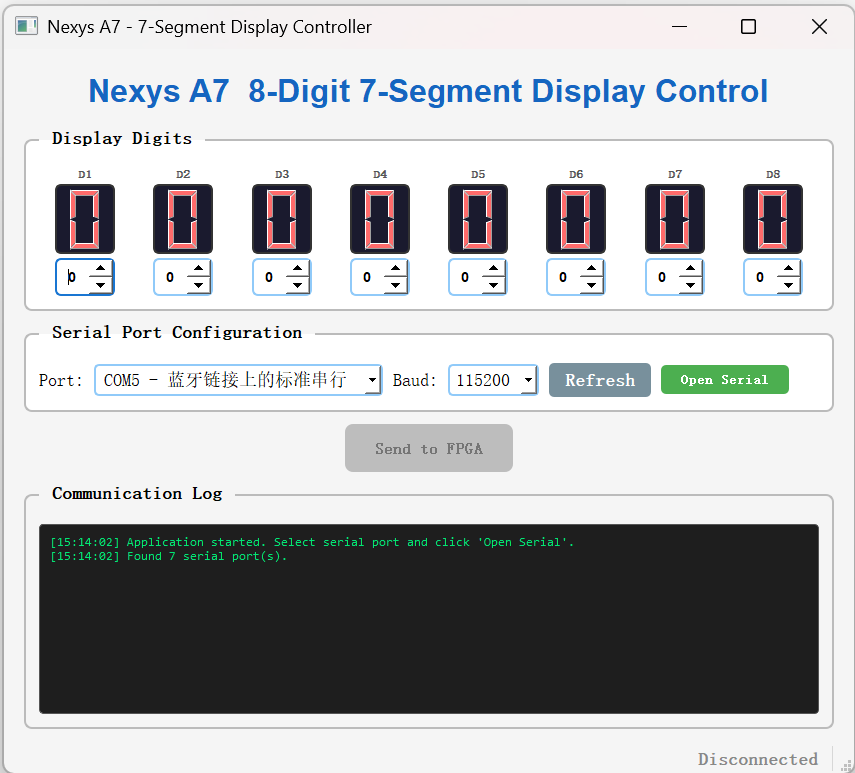
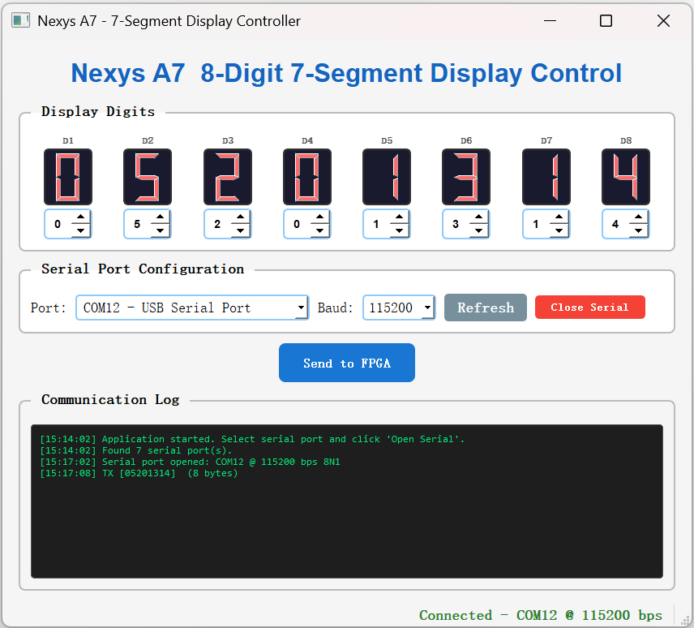
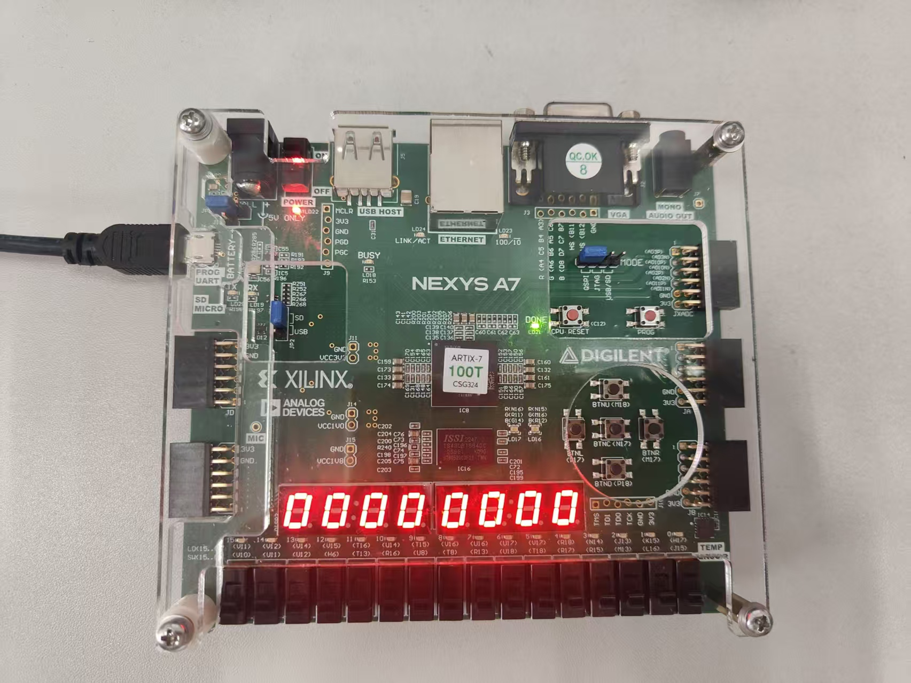
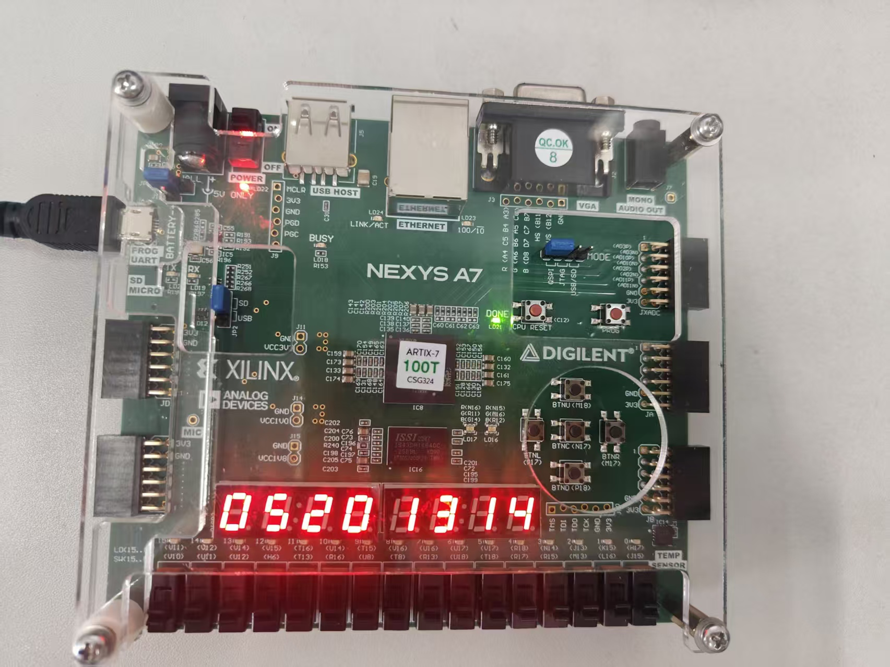

# Nexys A7 八位数码管 UART 控制项目

## 项目概述

通过 Qt 上位机（PC）经由 UART 串口，控制 Digilent Nexys A7 开发板上的 8 个七段数码管显示数字。

**工作流程：**

```
Qt GUI (PC) ---USB/UART--> Nexys A7 (FPGA)
    |                           |
    |-- 设置 8 个数字 0~9        |-- UART 接收模块
    |-- 点击 [发送]              |-- 解析 8 个字节
    +-- 发送 8 字节              +-- 更新 8 个数码管显示
```

---

## 目录结构

```
Drive_seven_segment_display/
+-- README.md                      本说明文件
+-- doc/
|   +-- 截图 (jpg/png)             上板验证效果截图
+-- src/                            Verilog 设计源文件
|   +-- uart_receiver.v             UART 接收模块 (115200 8N1)
|   +-- seven_seg_driver.v          8位七段数码管动态扫描驱动
|   +-- top.v                       顶层模块（整合以上两个模块）
+-- xdc/
|   +-- system.xdc                  有效约束文件（供综合/实现使用）
+-- prj/
|   +-- Drive_seven_segment_display.xpr   Vivado 工程文件
+-- Qt_GUI/
    +-- Drive_seven_segment_display_Qt_GUI/
        +-- Drive_seven_segment_display_Qt_GUI.pro    Qt 工程文件
        +-- main.cpp               程序入口
        +-- mainwindow.h           主窗口头文件
        +-- mainwindow.cpp         主窗口实现（界面+串口逻辑）
        +-- mainwindow.ui          UI 占位文件
```

---

## 一、FPGA 端（Vivado 综合、实现、烧录）

### 1. 打开 Vivado 工程

方法 A - 直接打开工程文件：

```
在 Vivado 中: File -> Open Project -> 选择 prj/Drive_seven_segment_display.xpr
```

方法 B - 新建工程并添加源文件：

```
1. File -> New Project -> Next
2. Project name: Drive_seven_segment_display
3. RTL Project -> 勾选 "Do not specify sources at this time" -> Next
4. 选择器件:
   - Part: xc7a100tcsg324-1
   （对应 Nexys A7-100T）
   - 或点击 Boards -> 选择 "Nexys A7-100T"
5. Finish
```

### 2. 添加设计源文件

在 Flow Navigator -> **PROJECT MANAGER** -> **Add Sources**：

- **Add or create design sources** -> Next
- 点击 **Add Files**，选择以下 3 个文件：
  - `src/top.v`
  - `src/uart_receiver.v`
  - `src/seven_seg_driver.v`
- 勾选 **Copy sources into project**（可选）
- Finish

### 3. 添加约束文件

- **Add Sources** -> **Add or create constraints** -> Next
- **Add Files** -> 选择 `xdc/system.xdc`
- Finish

### 4. 综合、实现、生成比特流

在 Flow Navigator 中依次点击：

```
1. Run Synthesis      (综合)
2. Run Implementation (实现)
3. Generate Bitstream (生成比特流)
```

也可以在 **Flow -> Open Implemented Design** 中查看引脚分配是否正确：

- 打开后点击 **I/O Ports** 标签
- 核对所有引脚是否与 `system.xdc` 一致

### 5. 下载bit流到开发板

```
1. 连接 Nexys A7 到电脑（USB 线，供电+编程）
2. Flow Navigator -> PROGRAM AND DEBUG -> Open Hardware Manager
3. Open target -> Auto Connect
4. Program Device -> 选择生成的 .bit 文件
```

> **提示：** 下载bit流完成后，如果还没接串口，数码管默认显示 `00000000`。

---

## 二、Qt 上位机（PC 端）

### 环境要求

- Qt 5.12+（本工程基于 Qt 5.12.0 MinGW 64-bit）
- 需要 `serialport` 模块（已在 .pro 文件中添加）

### 编译运行

**方法 A - Qt Creator：**

```
1. 打开 Qt Creator
2. File -> Open File or Project
3. 选择 Qt_GUI/Drive_seven_segment_display_Qt_GUI/
   Drive_seven_segment_display_Qt_GUI.pro
4. 点击 Configure Project
5. 点击左下角 Run（绿色三角）编译并运行
```

**方法 B - 命令行：**

```bash
cd Drive_seven_segment_display/Qt_GUI/Drive_seven_segment_display_Qt_GUI
qmake
mingw32-make
# 运行生成的 exe
```

### 界面操作说明

界面从上到下分为四个区域：

#### 1) 数码管显示区

```
+---------+-----+-----+-----+-----+-----+-----+-----+-----+
| 标签    | D1  | D2  | D3  | D4  | D5  | D6  | D7  | D8  |
| LCD显示 | [0] | [0] | [0] | [0] | [0] | [0] | [0] | [0] |  红色LCD
| 数值框  | [0] | [0] | [0] | [0] | [0] | [0] | [0] | [0] |  点击调整
+---------+-----+-----+-----+-----+-----+-----+-----+-----+
```

- 每个数码管对应一列：标签 D1~D8，红色 LCD 显示当前值，下方的数字框可调整 0~9
- **D1 = 最右边数码管，D8 = 最左边数码管**

> **关于数码管的顺序说明：**
> 开发板实物上，最左边的是第 1 位数码管（AN7），最右边的是第 8 位数码管（AN0）。
> 协议约定：发送的第 1 字节 -> AN0（最右侧），第 8 字节 -> AN7（最左侧）。
> Qt 界面上 D1 对应第 1 字节（最右侧），D8 对应第 8 字节（最左侧）。

#### 2) 串口配置区

| 控件 | 说明 |
|------|------|
| Port 下拉框 | 选择 Nexys A7 对应的串口号（如 COM3） |
| Baud 下拉框 | 选择波特率，**默认 115200**（必须与 FPGA 一致） |
| Refresh 按钮 | 刷新可用串口列表 |
| Open/Close 按钮 | 打开/关闭串口连接 |

> **如何确定串口号：**
> 1. 用 USB 线连接 Nexys A7 的 USB-UART 口（通常是 **J4**，靠近电源开关的 Micro-USB 口）
> 2. 打开 Windows 设备管理器 -> 端口（COM 和 LPT）
> 3. 找到 "Digilent USB Device" 或 "USB Serial Port" 对应的 COM 号
> 4. 在 Qt 界面的 Port 下拉框中选择该 COM 口

#### 3) 发送按钮

- 设置好 8 个数字后，点击 **Send to FPGA**
- 按钮只有在串口打开后才可用
- 发送成功后，开发板上的数码管应立刻更新

#### 4) 通信日志

- 显示所有发送/接收的数据和时间戳
- 发送日志格式：`[hh:mm:ss] TX [12345678] (8 bytes)`
- 接收日志格式：`[hh:mm:ss] RX [hex data]`

### 上位机界面截图

**初始状态：**


**发送数字后的效果：**


### 完整操作步骤

```
1. 用 USB 线连接 Nexys A7 到电脑（需要两根线：一根编程，一根 UART）
   +-- 编程口（Micro-USB）：烧录比特流
   +-- UART 口（Micro-USB，J4）：串口通信

2. 打开 Vivado 烧录 .bit 文件到 FPGA
   +-- 确认烧录成功，数码管显示 00000000

3. 打开 Qt 上位机
   +-- 选择对应的 COM 口
   +-- 波特率保持 115200
   +-- 点击 Open Serial

4. 在界面上调整 8 个数字（例如：12345678）
   +-- 每个数字框点击上下箭头或直接输入 0~9

5. 点击 Send to FPGA
   +-- 日志区显示 TX [12345678] (8 bytes)
   +-- 开发板数码管显示 12345678

6. 修改数字，再次发送...

7. 使用完毕后点击 Close Serial
```

---

## 三、串口通信协议

### 格式

| 项目 | 值 |
|------|-----|
| 波特率 | 115200 |
| 数据位 | 8 |
| 停止位 | 1 |
| 校验位 | 无 |
| 流控制 | 无 |

### 数据帧

上位机一次性发送 **8 个字节**：

```
字节索引:   0     1     2     3     4     5     6     7
对应数码管: D1    D2    D3    D4    D5    D6    D7    D8
            (最右)                               (最左)
值范围:    0~9   0~9   0~9   0~9   0~9   0~9   0~9   0~9
```

示例：要显示 `12345678`，发送的 8 字节为：

```
0x01  0x02  0x03  0x04  0x05  0x06  0x07  0x08
```

### FPGA 处理逻辑

1. 收到第 1 字节 -> 存到 digit0，字节计数器 +1
2. 收到第 2 字节 -> 存到 digit1，字节计数器 +1
3. ...依次类推
4. 收到第 8 字节 -> 存到 digit7，字节计数器归零
5. 如果继续发送第 9 字节 -> 重新从 digit0 开始覆盖

---

## 四、上板验证效果

**下载bit流成功后，数码管显示 `00000000`：**


**通过上位机发送数字后，数码管更新显示：**


---

## 五、常见问题

### Q: 串口打开失败 / 找不到串口

- 确认 USB-UART 线已连接（开发板上的 J4 口）
- 点击 **Refresh** 刷新串口列表
- 检查设备管理器中是否有未知设备，可能需要安装 FTDI 驱动
- Nexys A7 的 USB-UART 使用 FTDI FT2232HQ 芯片，从 Digilent 官网下载驱动

### Q: 波特率怎么选

FPGA 端固定 115200，Qt 端必须选择相同的 **115200**，否则通信乱码。

### Q: 发送了但数码管不变

- 检查串口是否已打开（状态栏显示 "Connected"）
- 检查波特率是否匹配（两边都要 115200）
- 检查 FPGA 是否已正确烧录（烧录后数码管应显示 00000000）
- 用串口调试助手（如 SSCOM）测试发送 8 字节看 FPGA 是否有响应

### Q: 数码管显示不对/乱码

- 检查串口接线：开发板的 UART 口是 J4（Micro-USB），不是编程口
- 检查波特率一致性
- 如果发送的字节值 > 9，对应数码管会熄灭（空白），这是正常行为

### Q: 数码管有闪烁

- 正常情况下 125Hz 刷新率不应有可见闪烁
- 如果闪烁，检查 100MHz 时钟是否正常输入
- 确保约束文件中的时钟引脚和周期设置正确

---

## 六、技术细节

### FPGA 资源使用估算

| 资源 | 使用量 |
|------|--------|
| LUT | ~100 |
| FF  | ~60 |
| I/O | 20 (1 时钟 + 1 复位 + 2 UART + 8 seg + 8 an + 1 dp) |

### 刷新时序

```
每个数码管点亮 1ms -> 8 个数码管循环一次 8ms -> 刷新率 125Hz
```

### UART 时序

```
100 MHz / 115200 = 868 个时钟周期/bit
误差 = 0.006%  (远小于 UART 容忍的 +/-2%)
```

---

## 七、硬件连接示意

```
Nexys A7 开发板
+-----------------------------------------+
|                                         |
|  [8个七段数码管] <<-- 内部连线 <<--      |
|                                         |
|  FPGA (xc7a100t)                        |
|    +-- UART_RX (C4) <-- FTDI <-- USB ---+---- PC (Qt上位机)
|    +-- seg[6:0]   --> 数码管段选        |
|    +-- an[7:0]    --> 数码管位选        |
|                                         |
|  USB-UART (J4)        USB-JTAG (编程口)  |
+-----------------------------------------+
```

---

## 八、文件修改记录

| 文件 | 说明 |
|------|------|
| `src/uart_receiver.v` | UART 接收，115200 8N1，状态机实现 |
| `src/seven_seg_driver.v` | 8位动态扫描，共阳极，125Hz刷新 |
| `src/top.v` | 顶层整合，8字节协议解析 |
| `xdc/system.xdc` | 引脚约束（时钟、复位、UART、数码管） |
| `Qt_GUI/.../mainwindow.h` | Qt 串口 + 8位显示界面声明 |
| `Qt_GUI/.../mainwindow.cpp` | 界面实现、串口收发逻辑 |
| `Qt_GUI/.../*.pro` | Qt 工程配置（含 serialport 模块） |

---

如有任何问题，欢迎提出！
